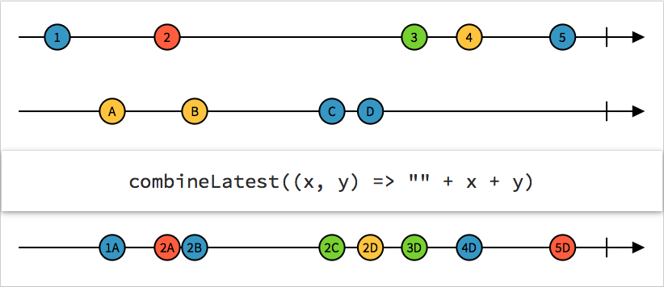
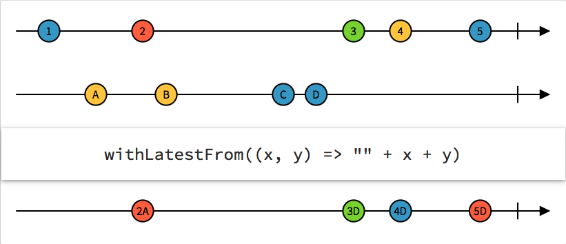
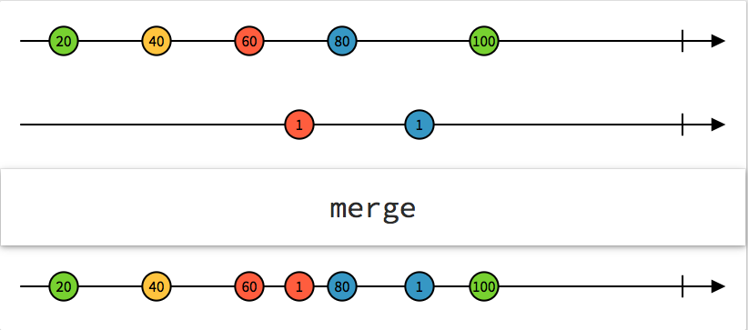
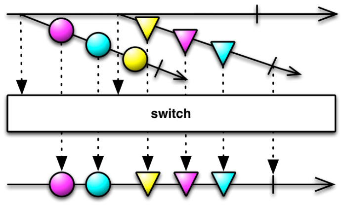
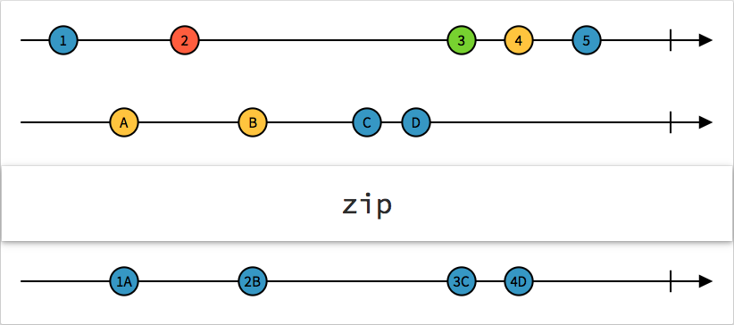
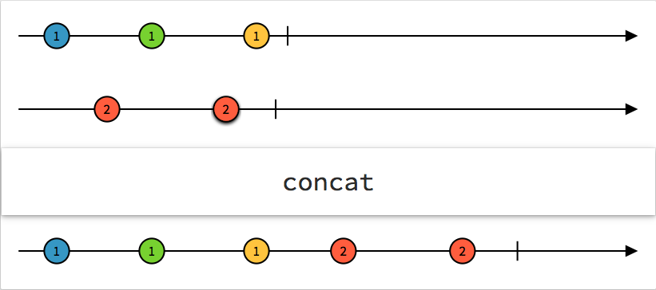

# RxSwift

## 정의
RxSwift를 사용 하면서 사용해본 내용들 정리

## 내용
### [combineLatest](http://rxmarbles.com/#combineLatest)
> 각각의 Obserable 이벤트가 발생 (내용 변경) 될때 가장 마지막 상태들을 가져와 전달한다. (두 이벤트 타입은 달라도 된다.)



#### Code
```
let boys = Observable.from(["boy1", "boy2", "boy3", "boy4"])
let girls = Observable.from(["gir1", "gir2", "gir3", "gir4", "gir5", "gir6"])
Observable
    .combineLatest(boys, girls) { return ($0, $1) }
    .subscribe { [weak self] in
        print($0)
    }.disposed(by: disposeBag)
```

#### Result

```
next(("boy1", "gir1"))
next(("boy2", "gir1"))
next(("boy2", "gir2"))
next(("boy3", "gir2"))
next(("boy3", "gir3"))
next(("boy4", "gir3"))
next(("boy4", "gir4"))
next(("boy4", "gir5"))
next(("boy4", "gir6"))
completed
```

### [withLatestFrom](http://rxmarbles.com/#withLatestFrom)
> 두개의 Obserable을 합성 하지만, 한쪽 이벤트가 발생할 때 합성해준다. 합성할 다른쪽 이벤트가 없으면 이벤트는 스킵된다.



#### Code
```
function()
function2()

func function() {
    print("start withLatestFrom function")
    let person = Observable.from(["boy1", "boy2", "boy3", "boy4"])
    let price = Observable.from([1000, 2000, 3000, 4000, 5000])
    person.withLatestFrom(price) {
        return ($0, $1)
    }.subscribe { [weak self] in
        print($0)
    }.disposed(by: disposeBag)
}
    
func function2() {
    print("start withLatestFrom function2")
    let person = Observable.from(["boy1", "boy2", "boy3", "boy4"])
    let price = Observable.from([1000, 2000])
    person.withLatestFrom(price) {
        return ($0, $1)
    }.subscribe { [weak self] in
        print($0)
    }.disposed(by: disposeBag)
}
```

#### Result

```
start withLatestFrom function
next(("boy1", 1000))
next(("boy2", 2000))
next(("boy3", 3000))
next(("boy4", 4000))
completed
start withLatestFrom function2
next(("boy1", 1000))
next(("boy2", 2000))
next(("boy3", 2000))
next(("boy4", 2000))
completed
```

### [merge](http://rxmarbles.com/#merge)
> 같은 타입의 Obserable에서 이벤트가 발생 하는대로 수신한다.



#### Code
```
let aTeam = Observable<Int>.interval(1, scheduler: MainScheduler.instance).map { "A : \($0)" }
let bTeam = Observable<Int>.interval(2, scheduler: MainScheduler.instance).map { "B : \($0)" }
let cTeam = Observable<Int>.interval(1, scheduler: MainScheduler.instance).map { "C : \($0)" }
let startTime = Date().timeIntervalSince1970

Observable.of(aTeam, bTeam, cTeam).merge().subscribe { [weak self] in
    print("\($0) : \(Int(Date().timeIntervalSince1970 - startTime))")
}.disposed(by: disposeBag)
```

#### Result

```
next(A : 0) : 1
next(C : 0) : 1
next(A : 1) : 2
next(B : 0) : 2
next(C : 1) : 2
next(A : 2) : 3
next(C : 2) : 3
next(A : 3) : 4
next(B : 1) : 4
next(C : 3) : 4
next(A : 4) : 5
next(C : 4) : 5
...
```

### switchLatest
> Obserable을 switch 할 수 있는 Obserable이다.
> 이벤트를 수신하고 싶은 아이템을 변경 할 수 있다.



#### Code
```
let aSubject = PublishSubject<String>()
let bSubject = PublishSubject<String>()
let switchTest = BehaviorSubject<Observable<String>>(value: aSubject)
        
switchTest.switchLatest().subscribe { [weak self] in
    print($0)
}.disposed(by: disposeBag)
        
aSubject.on(.next("AA-1"))
bSubject.on(.next("BB-1"))
switchTest.on(.next(bSubject))
aSubject.on(.next("AA-2"))
bSubject.on(.next("BB-2"))
aSubject.on(.next("AA-3"))
bSubject.on(.next("BB-3"))
bSubject.on(.next("BB-4"))
```

#### Result

```
next(AA-1)
next(BB-2)
next(BB-3)
next(BB-4)
```

### [zip](http://rxmarbles.com/#zip)
> 각각의 Obserable의 발생 순서가 같은 이벤트를 조합하여 이벤트를 발생
> 3개인 경우에는 3개씩 각 짝이 생겼을때 이벤트 발생



#### Code
```
let name = Observable.from(["A", "B", "C"])
let cost = Observable.from([1, 2, 3, 4, 5])
let status = Observable.from([true, false, false])
        
Observable.zip(name, cost, status) { ($0, $1, $2) }
    .subscribe { [weak self] in
        print($0)
    }.disposed(by: disposeBag)
```

#### Result

```
next(("A", 1, true))
next(("B", 2, false))
next(("C", 3, false))
completed
```

### [concat](http://rxmarbles.com/#concat)
> 같은 타입의 Observable 을 직렬로 연결한다. 하나의 array라고 생각해도 됨



#### Code
```
let a = Observable.from(["A", "B", "C", "D", "E"])
let b = Observable.from(["1", "2", "3"])
        
a.concat(b).subscribe { [weak self] in
        print($0)
    }.disposed(by: disposeBag)
```

#### Result

```
next(A)
next(B)
next(C)
next(D)
next(E)
next(1)
next(2)
next(3)
completed
```

## 참고
* https://brunch.co.kr/@tilltue/6